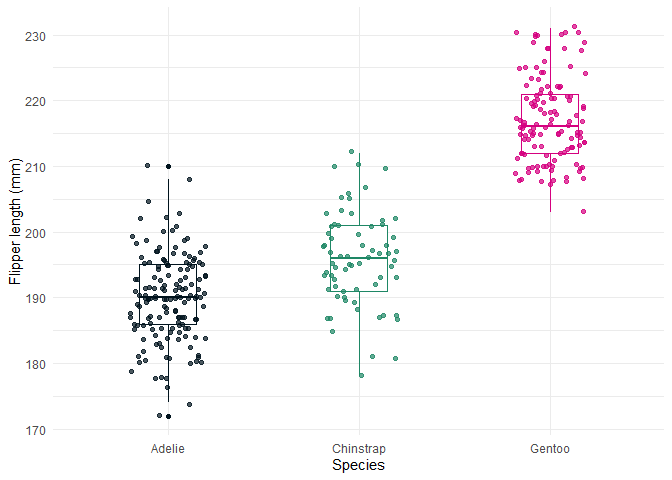

# University of Southampton Colour Palettes

`sotoncolours` provides colour palettes for use with `plot` or `ggplot2`
based upon the [University of Southampton colour
palettes](https://www.southampton.ac.uk/brand/category/colour/) of
`neutral`, `marine`, `horizon` and `web`.

The code is largely re-purposed from the [ochRe
package](https://github.com/ropenscilabs/ochRe)

It has two functions for use with `ggplot2`, either as discrete colours
or gradients:

  - `scale_fill_uos()`
  - `scale_colour_uos()`

and the palettes or specific colours can be called using `uos_cols()`
and/or `uos_colours`. Colours can be used in the base plotting functions
too.

See examples below and more details in the vignette.

## Installation

Use can install from github using `devtools`. Run
`install.packages("devtools")` if necessary first.

``` r
devtools::install_github("ab604/sotoncolours", build_vignettes = TRUE)
```

``` r
vignette("sotoncolours")
```

and then load the library as usual:

``` r
library(sotoncolours)
```

## Colour and palette choices

The package contains 19 colours and 7 colour palettes contained within a
named character vector called `uos_colours`:

``` r
# Named character vector of the colours
uos_colours
```

    ##     black  neutral1  neutral2  neutral3  neutral4   marine1   marine2   marine3 
    ## "#00131D" "#495961" "#758D9A" "#9FB1BD" "#E1E8EC" "#005C84" "#74C9E5" "#3CBAC6" 
    ##   marine4   marine5   marine6  horizon1  horizon2  horizon3  horizon4  horizon5 
    ## "#B3DBD2" "#4BB694" "#C1D100" "#FCBC00" "#EF7D00" "#E73037" "#D5007F" "#8D3970" 
    ##  prussian  shamrock     coral 
    ## "#002E3B" "#1E8765" "#E73238"

``` r
# See names of all palettes
names(uos_palettes)
```

    ## [1] "marine"    "horizon"   "neutral"   "web"       "contrast1" "contrast2"
    ## [7] "contrast3"

## The palettes

``` r
pal_names <- names(uos_palettes)

par(mfrow=c(length(uos_palettes)/2, 2), lheight = 2, mar=rep(1, 4), adj = 0)
for (i in 1:length(uos_palettes)){
    viz_palette(uos_palettes[[i]], pal_names[i])
}
```

<!-- --><!-- -->

## Example

Here is an example using [Alison Horst’s Palmer Penguins
dataset](https://github.com/allisonhorst/palmerpenguins) and `ggplot2`
and `scale_fill_uos()`

``` r
library(palmerpenguins)
library(ggplot2)

ggplot(data = penguins, aes(x = flipper_length_mm)) +
  geom_histogram(aes(fill = species), 
                 alpha = 0.5, 
                 position = "identity") +
  scale_fill_uos(palette = "contrast1") +
  theme_minimal() +
  labs(x = "Flipper length (mm)",
       y = "Frequency",
       title = "Penguin flipper lengths")
```

<!-- -->

Here is a base R `plot` using the `horizon` palette directly via the
`colorRampPalette()` function.

``` r
pal <- colorRampPalette(uos_palettes[["horizon"]])
image(volcano, col = pal(20))
```

<!-- -->

Individual palettes can be visualised using the `viz_palette` function

``` r
viz_palette(uos_palettes[["marine"]])
```

<!-- -->

It’s possible, but messy, to pick any colour combination from
`uos_colours`, but the syntax requires extracting the hex codes using
`unname()` and subsetting `uos_cols` using a character vector of the
desired colour names.

It may be easier to create an object for any bespoke palette and pass
then pass it to the respective `ggplot` function.

Here’s an example with the Palmer penguin data using
`unname(uos_colours[c("black","shamrock","horizon4")])` as described
above by creating a new palette called `my_cols` that is passed to the
`values` argument of `scale_colour_manual()`.

``` r
# Create a new vector of colours to pass to scale_colour manual
# Use unname() to get hex codes from uos_cols()
my_cols <- unname(uos_colours[c("black","shamrock","horizon4")])

ggplot(data = penguins, aes(x = species, y = flipper_length_mm)) +
  geom_boxplot(aes(color = species), width = 0.3, show.legend = FALSE) +
  geom_jitter(aes(color = species), alpha = 0.7, show.legend = FALSE, 
              position = position_jitter(width = 0.2, seed = 0)) +
  scale_colour_manual(values = my_cols) + # pass my_cols to scale_colour_manual
  theme_minimal() +
  labs(x = "Species",
       y = "Flipper length (mm)")
```

<!-- -->
