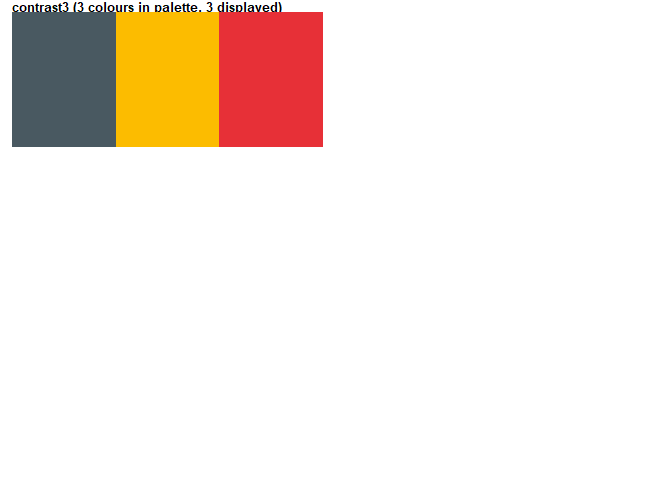
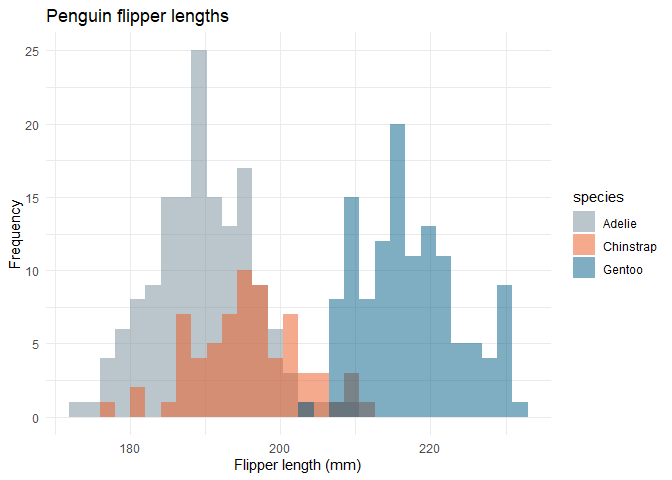

# University of Southampton Colour Palettes

`sotoncolours` provides colour palettes for use with `plot` or `ggplot2`
based upon the [University of Southampton colour
palettes](https://www.southampton.ac.uk/brand/category/colour/) of
`neutral`, `marine`, `horizon` and `web`.

The code is largely re-purposed from the [ochRe
package](https://github.com/ropenscilabs/ochRe)

It has two functions for use with `ggplot2`, either as discrete colours
or gradients:

  - `scale_fill_uos()`
  - `scale_colour_uos()`

and the palettes can be called in the base plotting functions too. See
examples below.

## Installation

Use can install from github using `devtools`. Run
`install.packages("devtools")` if necessary first.

``` r
devtools::install_github("ab604/sotoncolours")
```

and then load the library as usual:

``` r
library(sotoncolours)
```

## The palettes

``` r
pal_names <- names(uos_palettes)

par(mfrow=c(length(uos_palettes)/2, 2), lheight = 2, mar=rep(1, 4), adj = 0)
for (i in 1:length(uos_palettes)){
    viz_palette(uos_palettes[[i]], pal_names[i])
}
```

<!-- --><!-- -->

## Example

Here is an example using [Alison Horst’s Palmer Penguins
dataset](https://github.com/allisonhorst/palmerpenguins) and `ggplot2`
and `scale_fill_uos()`

``` r
library(palmerpenguins)
library(ggplot2)

ggplot(data = penguins, aes(x = flipper_length_mm)) +
  geom_histogram(aes(fill = species), 
                 alpha = 0.5, 
                 position = "identity") +
  scale_fill_uos(palette = "contrast1") +
  theme_minimal() +
  labs(x = "Flipper length (mm)",
       y = "Frequency",
       title = "Penguin flipper lengths")
```

<!-- -->

Here is a base R `plot` using the `horizon` palette directly via the
`colorRampPalette()` function.

``` r
pal <- colorRampPalette(uos_palettes[["horizon"]])
image(volcano, col = pal(20))
```

<!-- -->

Individual palettes can be visualised using the `viz_palette` function

``` r
viz_palette(uos_palettes[["marine"]])
```

<!-- -->
